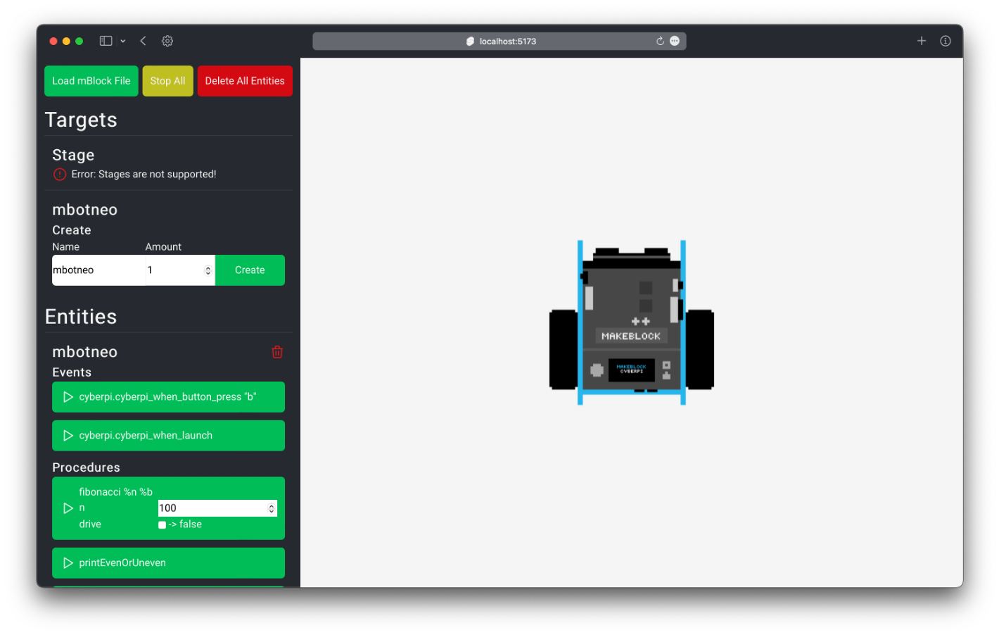

# mblock-simulator

The mBlock Simulator is able to simulate mBlock code for various [Makeblock](https://www.makeblock.com) devices. See [supported devices](#supported-devices) for a list of supported mBlock Devices.

✨ Tip: Check out [embe](https://github.com/Bananenpro/embe) for a more efficient way of writing mBlock code.

## Usage

1. Install the dependencies: `npm install`
2. Build: `npm run build`
3. Serve the site: `node build` (`HOST` and `PORT` can be set using environment variables.)

## Supported Devices

- CyberPI
- MBot2

## Demo

The following image shows what the simulator looks like after loading the `demo.mblock` file from the [demo folder](demo/).

The sidebar features two sections: 
1. The "Targets" section displays the programs contained in the `.mblock` file.
2. The "Entities" section displays the active instances of the available targets.

The simulator view is located to the right of the sidebar. It contains a sprite for each entity that has physics enabled.

